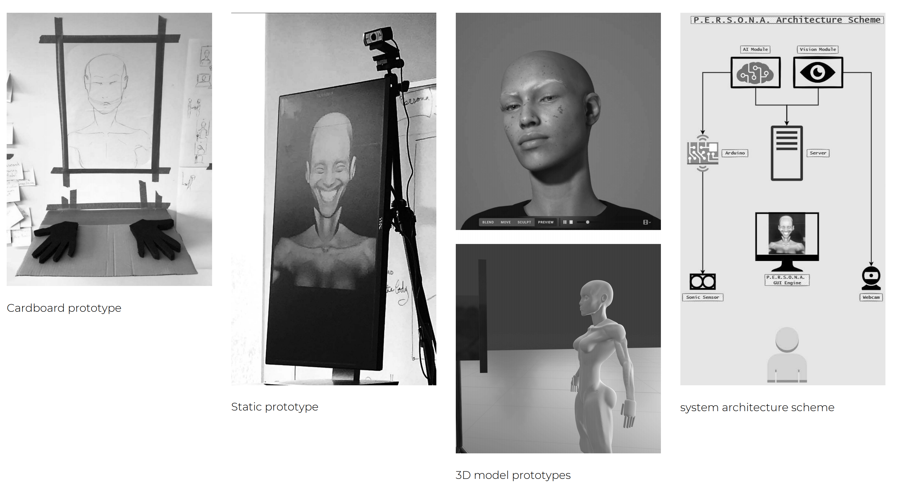
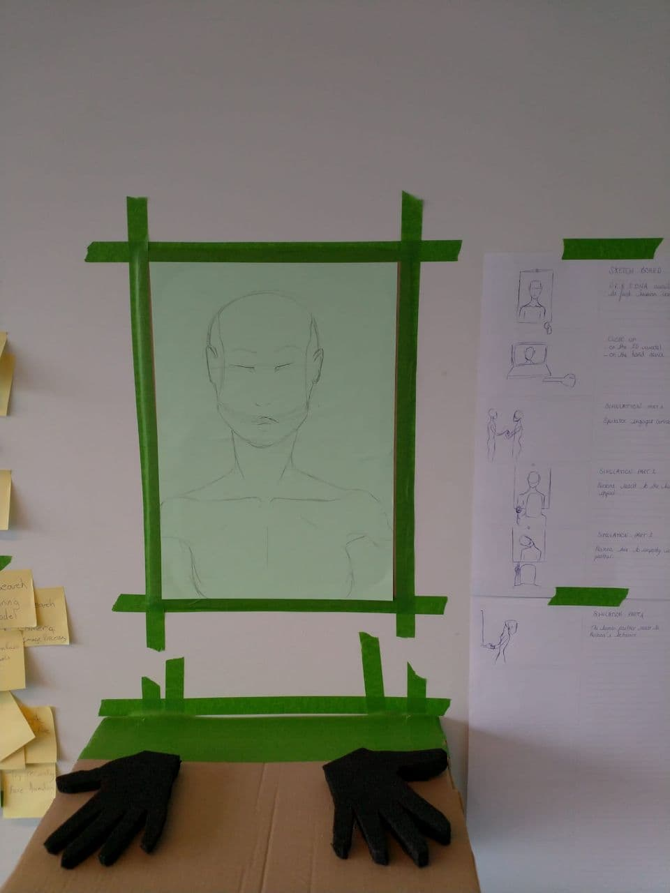
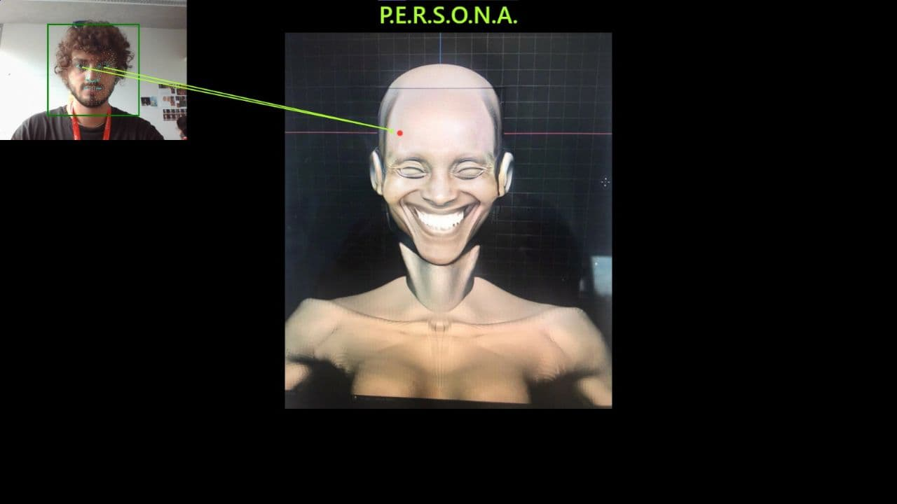
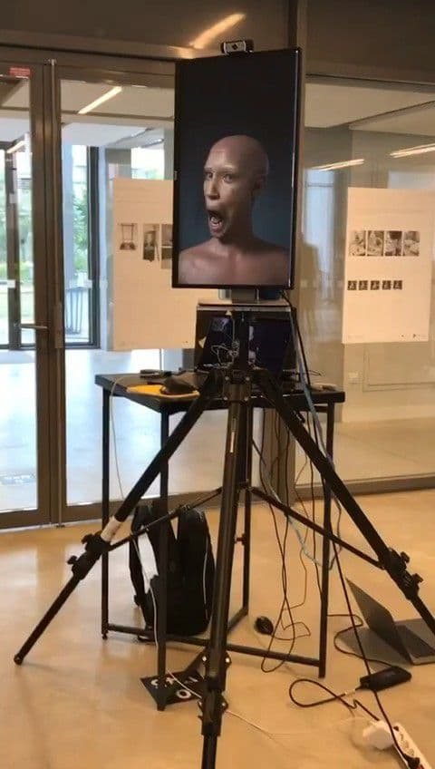
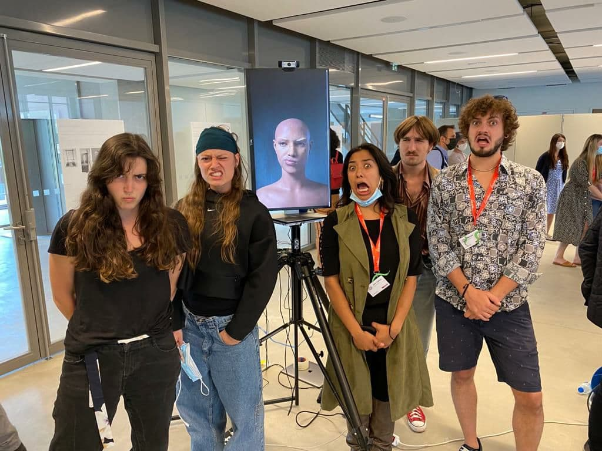

# P.E.R.S.O.N.A.

## Portraying Empathic Robotic Simulations Of Natural Affections
This repository contains the core of P.E.R.S.O.N.A., an AI created for artistic expression of human empathy during the [CreARTathon](https://creartathon.com/) competition.
Several modules, listed below, have been integrated together to obtain the final art piece:
- The computer vision module is based [WebGazer](https://github.com/brownhci/WebGazer).
- The implementation of the Multi-Armed Bandit problem using SoftMax algorithm to train P.E.R.S.O.N.A. has been inspired by [Kenneth Foo](https://medium.com/analytics-vidhya/multi-armed-bandit-analysis-of-softmax-algorithm-e1fa4cb0c422).
- The 3D model and facial expression of P.E.R.S.O.N.A. have been created using [MetaHuman](https://www.unrealengine.com/en-US/metahuman-creator?sessionInvalidated=true) and [UnrealEngine](https://www.unrealengine.com/).
- The ultrasonic proximity sensor is powered by [Arduino](https://www.tutorialspoint.com/arduino/arduino_ultrasonic_sensor.htm)

To run the computer vision server, go to the right folder with
`cd persona_server`

Then if you are running server and Unreal Engine on the same local network, use
`flask run --cert=adhoc --port=5000`

Remember to change `persona_gui_addr` in `app.py` with the address of the pc running UE. On the same pc, you can use
`persona_gui_addr = 'localhost'`

### Context
From Mary Schelley’s Frankestein to Spike Jonze’s Her, humans’ desire to create an entity able to establish communication pervades
literature and cinema. May it be a dreadful creature or the ideal partner, the idea of designing an intelligent machine to interact
with has been obsessing us for centuries. Today, from Alexa to sex-bots or Japanese robot pets, developers seek to design the useful
partner, the perfect companion.

Persona is one of these embodied AI. It is intended to interact with human beings and learn, from all its encounters, how to get on
with them.
It is a realistic humanlike entity, but unlike most of its fellows, it has a singular body language. While developers want to get rid of
the uncanny valley feeling, we seek to develop a peculiar behavior with Persona.
Persona’s purpose is not to solve humans’ problems like most AIs but to raise doubts, interrogations.
It is about challenging the perception of the visitors about AI; do I see a human, do I see a puppet?
And also about ourselves; what does our behavior towards Persona says about our relationship with the unusual, the unknown, the
‘alien'?

### How it works

Over the course of the exhibition and throughout the
multiple encounters with the visitors, Persona will evolve
and learn how to break the diffidence barrier with
humans, it will develop its own way to understand them
and to communicate with each of them. This learning
process will be complex, chaotic and a very long journey
for Persona as its teachers will be multiple and diverse,
reacting in their own ways to its attempts of interaction.

## Design Process

The project was realized by following the DOIT (Design Of Interactive Things) design process by [Wendy Mackay](https://en.wikipedia.org/wiki/Wendy_Mackay)
which produced a first cardboard prototype of P.E.R.S.O.N.A. appearance and interaction.

We then created a static prototype and embedded the computer vision functionalities using WebGazer.

We demoed the final interactive prototype, rendered with Unreal Engine, the final day of the hackaton and collected data 
from the interactions with the audience.

The team that created P.E.R.S.O.N.A has multidisciplinary background in Computer Science, Data Science, Human-Computer Interaction,
Graphic Design and Fine Arts.

From left to right Joséphine Raugel, Anaïs Legros, Julia Valeria Lopez Rojas, Léo Thizy and Michele Romani.
